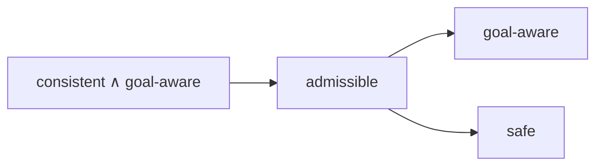

# Week 3 — Heuristic Search Algorithms

> [!abstract] Orientation — read this first (~1 min)
> **The problem this week solves.** Blind search expands $b^d$ nodes because it has no
> opinion about which node to expand next. Week 3 supplies the opinion: a function
> estimating how far each state is from a goal, a set of properties for judging whether
> that function can be trusted, and six algorithms that consume it. After this you can
> state, for any pairing of algorithm and heuristic, whether the search is complete and
> whether it returns an optimal plan, and prove it.
>
> **Core claims**
> 1. A heuristic function estimates remaining cost; the perfect heuristic $h^*$ is
>    useless in practice because computing it per state means solving an exponential
>    problem per state.
> 2. Four properties characterise a heuristic: safe, goal-aware, admissible, consistent.
>    Consistent and goal-aware together give admissible; admissible gives goal-aware;
>    admissible gives safe. Nothing else follows.
> 3. A safe heuristic makes greedy best-first search and A\* complete, because the
>    infinite-$h$ test is the only line where either algorithm throws a branch away.
> 4. Greedy best-first search is never guaranteed optimal, and no property of $h$ fixes
>    that, since ordering on $h$ alone ignores what the path already cost.
> 5. A\* is optimal exactly when $h$ is admissible, and the proof runs through the
>    theorem that A\* expands every node with $f \le g^*$.
> 6. Weighted A\* turns one constant into a dial across Dijkstra ($W=0$), A\* ($W=1$)
>    and greedy best-first search ($W \to \infty$), with a factor-$W$ suboptimality bound.
> 7. Local search buys a small memory footprint by discarding branches permanently, and
>    pays for it with every guarantee. Enforced hill-climbing recovers reach without
>    recovering guarantees.
> 8. Novelty and heuristics compose: BFWS orders on novelty computed *within* a
>    heuristic level, and has topped the IPC satisficing tracks since 2018.
>
> **Prerequisites.** [[blind-search]], [[breadth-first-search]], [[search-node]],
> [[novelty]], [[planning-complexity]].
> **Where it sits.** Week 2 gave the algorithms with no guidance; week 3 adds the
> guidance and the theory for judging it. Weeks 4 and 5 answer the question this week
> leaves open, which is where a heuristic comes from without a human writing it.
> **Sources.** 9 videos (58 min) + 2 live lectures + deck (57 slides) ·
> **digest read time ~30 min**

---

## The Spine

### Where the week starts: the model is a graph
`slides 2–5` · live lecture (Canvas)

The ambition stated on slide 2 is one program that solves all classical search problems.
The state model $\mathcal{S}(P)$ is the week 1 definition unchanged: a finite discrete
state space $S$, a known initial state $s_0$, goal states $S_G \subseteq S$, actions
$A(s)$ applicable in each state, a deterministic transition function $s' = f(a,s)$, and
positive action costs $c(a,s)$. A solution is an applicable action sequence mapping
$s_0$ into $S_G$, and it is optimal when it minimises the sum of action costs.

Search algorithms exploit the correspondence between that model and a directed graph.
Nodes are states, edges are transitions carrying the same cost, and planning as
heuristic search means running path-finding over the graph associated with
$\mathcal{S}(P)$.

Slide 4 sets up two independent axes that classify everything in the deck.

| | Systematic | Local |
|---|---|---|
| **Blind** | DFS, BrFS, uniform cost (Dijkstra), ID | random walk |
| **Heuristic** | A\*, IDA\*, best-first, WA\*, DFS B&B, LRTA\* | hill-climbing |

The axes are not clean partitions. Enforced hill-climbing is an explicit crossbreed,
and the deck says so. Slide 5 states where each combination pays off: for satisficing
planning heuristic search beats blind search essentially everywhere, and for optimal
planning it also wins but by less. Systematic and local search both have successes in
satisficing planning; for optimal planning, systematic is mandatory.

---

### Heuristic functions
`slides 9–12` · [`0:00`](https://www.youtube.com/watch?v=wlYSyLCYAt4)

> [!info] Definition (Heuristic Function)
> Let $\Pi$ be a planning task with state space $\Theta_\Pi$. A *heuristic function*,
> short *heuristic*, for $\Pi$ is a function $h : S \mapsto \mathbb{R}_0^+ \cup
> \{\infty\}$. Its value $h(s)$ for a state $s$ is the state's *heuristic value*, or
> *h-value*.

> [!info] Definition (Remaining Cost, $h^*$)
> For a state $s \in S$, the state's *remaining cost* is the cost of an optimal plan for
> $s$, or $\infty$ if no plan exists. The *perfect heuristic* for $\Pi$, written $h^*$,
> assigns every $s \in S$ its remaining cost as heuristic value.

Slide 11 makes the point that decides how the rest of the subject treats heuristics.
For most heuristic search algorithms, $h$ needs no properties at all for the algorithm
to be correct and terminate. Any function from states to numbers works. What changes is
performance, and performance depends on how well $h$ reflects $h^*$, informally called
the *informedness* or *quality* of $h$.

That suggests aiming for $h^*$ itself, and the Monday lecture kills the idea by
arithmetic. Planning is PSPACE-complete, so on a deterministic machine it is exponential
in the number of variables. Querying $h^*$ once means solving an exponential problem
once. A search queries its heuristic on every generated state. The useful heuristic is
therefore the one approximating $h^*$ closely while staying cheap, and the two pull
against each other.

The opposite extreme is $h(s) = 0$ everywhere. It carries no information, cannot
distinguish any two states, and reduces heuristic search to [[blind-search]]. Any
constant does the same, since only the relative order of $h$-values matters.

> [!mic] Not on the slides — [`w03a` live]
> The class was asked which algorithm behaves like $h = 0$ and answered "greedy".
> Lipovetzky redirected: the answer is blind search, and he tied it back to week 2 by
> contrast. Novelty is also information-free about the future, but it extracts
> information from the search's *past* (what atom combinations have been seen), whereas a
> heuristic estimates the future. That contrast is what BFWS later exploits.

---

### The four properties
`slide 13` · [`0:14`](https://www.youtube.com/watch?v=Xd43DqmDnqg&t=14s)

> [!info] Definition (Safe / Goal-Aware / Admissible / Consistent)
> Let $\Pi$ be a planning task with states $S$, goal states $S_G$, cost function $c$, and
> let $h$ be a heuristic for $\Pi$. The heuristic is called
> - *safe* if $h^*(s) = \infty$ for all $s \in S$ with $h(s) = \infty$;
> - *goal-aware* if $h(s) = 0$ for all goal states $s \in S_G$;
> - *admissible* if $h(s) \le h^*(s)$ for all $s \in S$;
> - *consistent* if $h(s) \le h(s') + c(a)$ for all transitions $s \xrightarrow{a} s'$.

Read in words. Safe: when the heuristic reports $\infty$, there really is no solution
from there, so pruning the branch loses nothing. Goal-aware: goals are recognised and
flagged with zero. Admissible: the heuristic is optimistic, always reporting a trip as
at least as fast as it truly is. Consistent: across one action, the heuristic may not
drop by more than that action costs.

The implications, stated at [`3:54`](https://www.youtube.com/watch?v=Xd43DqmDnqg&t=234s):



No other implication among the four can be proved. The videos leave the proofs as an
exercise and suggest convincing yourself by example if a full proof does not come.

> [!example] Worked exercise — which properties hold?
> A three-node graph, all action costs 1. The initial state $I$ has $h = 2$ and two
> outgoing actions: one to a goal $G$ with $h = 0$, one to a state $D$ with $h = 1$ whose
> only action is a self-loop.
>
> First compute the truth. $h^*(I) = 1$, because $G$ is one action away. $h^*(D) =
> \infty$, because the self-loop is the only action and $D$ is not a goal. $h^*(G) = 0$.
>
> **Goal-aware?** Yes. $h(G) = 0$.
> **Admissible?** No. $h(I) = 2 > 1 = h^*(I)$. One violating state is enough.
> **Consistent?** No. Across $I \to G$ the heuristic falls from 2 to 0, a drop of 2,
> while the action costs 1. One violating transition is enough.
> **Safe?** Yes, vacuously. Safety requires that wherever $h$ says $\infty$, $h^*$ is
> $\infty$. This heuristic never says $\infty$, so the condition has nothing to violate.
> The tempting answer is "unsafe, it missed the dead end at $D$", which reverses the
> implication: safety governs what $h$ may claim when it reports $\infty$, and never
> requires it to report $\infty$. Asked how to make it unsafe, the class got there: set
> $h(I) = \infty$, and the heuristic now denies a solution that exists.
>
> Sanity-check against the implication diagram. Safe and inadmissible together are fine,
> since the arrow runs admissible $\Rightarrow$ safe and only forbids the reverse pairing.

> [!mic] Not on the slides — [`w03a` live]
> Two things Lipovetzky flagged directly. First, "one that is a bit dangerous, and I see
> many students tripping, is about safety and admissibility, and consistency: check the
> properties with respect to the *optimal* heuristic." Every definition compares $h$
> against $h^*$, so you cannot evaluate any of them without computing $h^*$ first.
> Second, on practice: "generate as many graphs and as many heuristics to test your
> intuition, and you don't need graphs greater than 3 nodes or 4 nodes." Small graphs
> are enough to break any wrong intuition you hold.

---

### Greedy best-first search
`slides 15–16` · [`0:42`](https://www.youtube.com/watch?v=OI_urviXsbI&t=42s)

```
Greedy Best-First Search (with duplicate detection)

open := new priority queue ordered by ascending h(state(σ))
open.insert(make-root-node(init()))
closed := ∅
while not open.empty():
    σ := open.pop-min()                      /* get best state */
    if state(σ) ∉ closed:                    /* check duplicates */
        closed := closed ∪ {state(σ)}        /* close state */
        if is-goal(state(σ)): return extract-solution(σ)
        for each (a, s') ∈ succ(state(σ)):   /* expand state */
            σ' := make-node(σ, a, s')
            if h(state(σ')) < ∞: open.insert(σ')
return unsolvable
```

Three operators carry the whole algorithm, and they are the same three from week 2:
`init()` names the initial state, `is-goal()` tests one, `succ()` generates successors.
Everything else is bookkeeping. The open list is the frontier, held as a min-heap keyed
on $h$. The closed list is the already-expanded interior, and exists only to catch
duplicates.

Properties, from slide 16 and the live discussion:

- **Complete** if $h$ is safe. The `h < ∞` test is the only line that discards part of
  the space. If a safe heuristic reports $\infty$, no solution was lost. If it reports
  $\infty$ where a solution exists, the search can walk past the region containing the
  only solution and report failure.
- **Not optimal**, and not fixable. Counterexample from the lecture: two goal states,
  one reachable at cost 1, the other at cost 1,000,000, running with $h^*$. Both goals
  have $h = 0$. The priority queue has no basis to order them, tie-breaking decides, and
  the algorithm returns the moment it pops a goal. Perfect information about the future
  does not help, because the flaw is ignoring the past.
- **Invariant** under any strictly monotonic transformation of $h$: scaling by a
  positive constant, or adding one, leaves the expansion order untouched.

Implementation notes from the deck: use a min heap; the duplicate check could equally
run during expansion, and sits after "get best state" here only to line the code up
with A\*.

---

### A\*
`slides 17–20` · [`1:04`](https://www.youtube.com/watch?v=hIam0NVNPOQ&t=64s)

```
A* (with duplicate detection and re-opening)

open := new priority queue ordered by ascending g(σ) + h(state(σ))
open.insert(make-root-node(init()))
closed := ∅
best-g := ∅                                  /* maps states to numbers */
while not open.empty():
    σ := open.pop-min()
    if state(σ) ∉ closed or g(σ) < best-g(state(σ)):
        /* re-open if better g; note that all σ' with same state but worse g
           are behind σ in open, and will be skipped when their turn comes */
        closed := closed ∪ {state(σ)}
        best-g(state(σ)) := g(σ)
        if is-goal(state(σ)): return extract-solution(σ)
        for each (a, s') ∈ succ(state(σ)):
            σ' := make-node(σ, a, s')
            if h(state(σ')) < ∞: open.insert(σ')
return unsolvable
```

$$f(s) := g(s) + h(s)$$

Two changes from greedy best-first search, and no others. The queue is keyed on $f$
rather than $h$, splitting the estimate into cost paid ($g$, read off the search node)
and cost to go ($h$). And a closed state is re-opened when reached with a strictly
smaller $g$: if the best known path to a state cost 10 and a new path reaches it at 7,
everything downstream needs recomputing, so the state is expanded again.

Terminology from slide 19, worth keeping straight because assignment marking uses it:

- **$f$-value** of a state: $f(s) := g(s) + h(s)$.
- **Generated nodes**: nodes inserted into open at some point.
- **Expanded nodes**: nodes $\sigma$ popped from open for which the test against
  *closed* and *distance* succeeds.
- **Re-expanded nodes**: expanded nodes for which $state(\sigma) \in closed$ upon
  expansion. Also called *re-opened*.

> [!example] Worked trace — A\* on the slide 18 graph
> Nodes are labelled $g + h$. The root is $0+3$.
>
> 1. Expand the root. Two children enter open: $1+2 = 3$ and $1+3 = 4$.
> 2. Open holds $\{3, 4\}$. Pop the minimum, $1+2$. Its children are $2+6 = 8$ and
>    $2+7 = 9$. Open is now $\{4, 8, 9\}$; closed holds the root and $1+2$.
> 3. Pop $1+3 = 4$. Children $2+5 = 7$ and $2+2 = 4$.
> 4. Pop $2+2 = 4$. Children $3+5 = 8$ and $3+1 = 4$.
> 5. Pop $3+1 = 4$. Children include $4+8 = 12$ and a goal node reached at cost 4 with
>    $h = 0$, so $f = 4$.
> 6. Pop that goal node and return. Total expansions: the root, $1+2$, $1+3$, $2+2$,
>    $3+1$, then the goal.
>
> The frontier is always the leaves of the tree drawn so far, and the closed set is
> always its interior. Nodes at $f = 8, 9, 12$ were generated and never expanded, which
> is the whole point of the $h$ term.

Remarks from slide 20:

- Ties on $f$ are popularly broken by preferring the smaller $h$.
- If $h$ is admissible **and** consistent, A\* never re-opens a state, so the `best-g`
  bookkeeping can be dropped.
- Checking duplicates at the wrong point is a common, hard-to-spot bug. The deck says
  outright that Russell and Norvig are too imprecise about this.
- The implementation shown is optimised for readability, not efficiency.

> [!mic] Not on the slides — [`3:00`](https://www.youtube.com/watch?v=Z8BrU1W0_aA&t=180s)
> The A\*-in-action video embeds Sebastian Thrun's own footage of the Stanford DARPA car
> and Lipovetzky corrects its scope afterwards. Thrun's planner runs A\* over an abstract
> discretisation with a straight-line Euclidean heuristic, replanning in under 10 ms as
> sensors reveal new obstacles, including a barrier that forces a multi-point turn
> ([`7:13`](https://www.youtube.com/watch?v=Z8BrU1W0_aA&t=433s) covers the reverse park).
> "A\* is not looking over the continuous state space. It's not a motion planner." The
> motion model is a separate lower layer. The historical point is the one to keep: A\*
> was invented in the 1970s by the Shakey researchers, out of problems they had failed to
> solve on that project, and it is the same algorithm driving the car forty years later.

---

### Why A\* is optimal
`slide 20` · live lectures, both halves

The proof is split deliberately across Monday and Friday, and the Monday half ends on a
question. Reconstructed whole:

**Step 1, the known theorem.** A\* expands every state whose $f$-value is smaller than
or equal to $g^*$, the cost of an optimal solution. Note $g^* = h^*(s_0)$.

**Step 2, the contrapositive.** Suppose A\* misses every optimal solution. Let $P$ be an
optimal trajectory, $|P| = J$. For A\* not to walk down $P$, some state on it must sit
outside the guaranteed-expanded region, meaning

$$\exists s \in P : g(s) + h(s) > g^*.$$

**Step 3, which term can do that.** $g$ is fixed by the problem, since it is the actual
accumulated cost of a real path. The only controllable term is $h$. So missing an
optimal solution requires $h$ to overestimate.

**Step 4, the conclusion.** Admissibility says $h(s) \le h^*(s)$ everywhere, which is
exactly the condition making step 3 impossible. An admissible heuristic guarantees A\*
returns an optimal solution.

Completeness needs nothing new: as with greedy best-first search, a safe heuristic is
enough, since the infinite-$h$ test remains the only discard.

> [!mic] Not on the slides — [`w03a` and `w03b` live]
> Lipovetzky drew the region argument on the whiteboard both times, and it is easier to
> hold as a picture than as algebra. Draw the set of nodes with $f \le g^*$ as a blob.
> Everything inside gets expanded, guaranteed. An optimal trajectory sits inside it. To
> make A\* miss that trajectory you must push part of it out of the blob, and the only
> lever you have is inflating $h$. He also noted the history twice: A\* was used from the
> 1970s, and this connection between heuristic properties and algorithm guarantees only
> arrived in the 1980s and 1990s, so for two decades nobody could say when A\* would
> return an optimal plan.

---

### Weighted A\*
`slides 22–23` · [`0:50`](https://www.youtube.com/watch?v=Pht6p_O3ONg&t=50s)

One character changes in the priority function:

$$f(s) := g(s) + W \cdot h(s), \qquad W \in \mathbb{R}_0^+$$

The rest of the algorithm, re-opening included, is A\* unchanged. The weight is an
algorithm parameter, and three settings recover three algorithms already known:

| $W$ | Priority reduces to | Algorithm |
|---|---|---|
| $0$ | $g(s)$ | uniform-cost search, that is, Dijkstra's algorithm |
| $1$ | $g(s) + h(s)$ | A\* |
| $\to \infty$ | $h(s)$ dominates, $g$ becomes negligible | greedy best-first search |

For $W > 1$ with an admissible $h$, weighted A\* is **bounded suboptimal**: solutions
returned are at most a factor $W$ more costly than optimal. Set $W = 2$ and the plan is
no worse than twice optimal.

> [!mic] Not on the slides — [`w03b` live]
> The dial has a practical use the deck does not mention. Some solvers run greedy first,
> take the cost of whatever solution comes back as an upper bound on path lengths worth
> considering, then dial $W$ down and search again for something better. That gives
> anytime behaviour: a usable plan early, improving with time spent. Lipovetzky also used
> weighted A\* to make a general point, which is that inventing a search algorithm mostly
> means changing the priority function, not writing new machinery.

---

### Hill-climbing
`slide 25` · [`0:34`](https://www.youtube.com/watch?v=kUTQO5LWA5U&t=34s)

```
Hill-Climbing

σ := make-root-node(init())
forever:
    if is-goal(state(σ)):
        return extract-solution(σ)
    Σ' := { make-node(σ, a, s') | (a, s') ∈ succ(state(σ)) }
    σ := an element of Σ' minimising h    /* random tie breaking */
```

No open list. Hold one node, expand it, keep the child with the smallest $h$, delete the
rest from memory, never switch branch. The video calls it gradient descent for discrete
state spaces, and the comparison is exact rather than decorative: both take the locally
steepest step and both stall at local minima.

Slide 25 states the precondition: hill-climbing makes sense only if $h(s) > 0$ for
$s \notin S_G$. The landscape drawing at
[`3:15`](https://www.youtube.com/watch?v=kUTQO5LWA5U&t=195s) shows why. Plot $h$ on the
vertical axis. A non-goal state sitting at $h = 0$ is a floor, and since every step
minimises $h$, the search settles there and has no move that improves anything.

> [!example] Worked poll — in which graph does hill-climbing fail?
> Four graphs, blind heuristic ($h = 0$ everywhere), asking where hill-climbing does not
> always find a solution. The class picked A; the resolution went graph by graph.
>
> **A, a plain connected graph.** Fine. Under $h = 0$ every child ties, so random
> tie-breaking makes the search a random walk, and a random walk on a connected graph
> reaches the goal eventually.
> **B, a region with no path back out.** Fails. Step in and you spend the rest of the
> run there. This is a genuine dead end.
> **C, a cycle.** Fails only under deterministic tie-breaking. "If you go to the
> left-hand side first, always," you loop. Random tie-breaking escapes.
> **D, one move to the goal.** Fine, trivially.

Optimality fails on the same two-goal example that defeats greedy best-first search: one
path of cost 1, one of cost a million, nothing in $h$ to separate them.

> [!mic] Not on the slides — [`w03b` live]
> Three asides worth keeping.
>
> On tie-breaking: a fixed order is not merely unlucky, it is exploitable. "If you choose
> to break ties by a fixed order, careful, because someone else can play against you."
> Random tie-breaking costs something to implement and is usually worth it.
>
> On when local search is safe at all: "in general, I would say if your search space is a
> directed graph, there is danger, because in an undirected graph, whatever you do, you
> can undo." A problem you can prove reversible is much less dangerous for local search.
>
> On a student question, does incompleteness imply non-optimality: mostly yes, and it is
> a good working intuition, but not strictly. Symmetry-breaking algorithms deliberately
> discard some solutions among many equivalent ones. They are incomplete by construction
> and still optimal, and doing so is recommended practice.

---

### Enforced hill-climbing
`slides 26–27` · [`0:51`](https://www.youtube.com/watch?v=6CO2-8ERKhI&t=51s)

```
Enforced Hill-Climbing: Procedure improve

def improve(σ₀):
    queue := new fifo queue
    queue.push-back(σ₀)
    closed := ∅
    while not queue.empty():
        σ = queue.pop-front()
        if state(σ) ∉ closed:
            closed := closed ∪ {state(σ)}
            if h(state(σ)) < h(state(σ₀)): return σ
            for each (a, s') ∈ succ(state(σ)):
                σ' := make-node(σ, a, s')
                queue.push-back(σ')
    fail
```

```
Enforced Hill-Climbing

σ := make-root-node(init())
while not is-goal(state(σ)):
    σ := improve(σ)
return extract-solution(σ)
```

A FIFO queue rather than a priority queue, so `improve` is a breadth-first search. Its
stopping condition is the first state whose $h$ is strictly smaller than the $h$ of the
state the call started from. Instead of looking one step ahead, the algorithm looks $k$
steps ahead systematically, for whatever $k$ the problem demands.

What happens next is the local half. The entire generated tree is thrown away and only
the path to the improving state is kept. The next call starts from there, comparing
against a new and lower value. Breadth-first search's problem is space rather than time,
and it exhausts memory within seconds on a real problem; discarding each layer after
committing is what keeps enforced hill-climbing bounded.

The payoff is a systematic escape from a local minimum, which plain hill-climbing has no
mechanism for. The qualification is depth. A wide local minimum forces the breadth-first
search deep, and the memory problem comes back.

Completeness and optimality are identical to hill-climbing's, for identical reasons.
Once `improve` returns, the alternatives are gone, so a commitment into a dead-end region
is as irreversible as before. Slide 27 also repeats the precondition: $h(s) > 0$ for
$s \notin S_G$.

> [!mic] Not on the slides — [`5:25`](https://www.youtube.com/watch?v=6CO2-8ERKhI&t=325s)
> "It was pretty much the main algorithm that was pretty well until 2012 in any planner,
> and it's still used for certain planning problems. I know that some applications in
> UAVs or underwater vehicles, they use this algorithm to find solutions." Also, on
> reading pseudocode generally: "whenever you see a queue, breadth-first search", and
> "when you have this kind of code, look at the stopping condition." The stopping
> condition is where the algorithm's identity lives.

---

### IDA\* and the properties table
`slide 28` · [`0:51`](https://www.youtube.com/watch?v=XXFvguum5rw&t=51s)

Slide 28 is a comparison table across DFS, BrFS, ID, A\*, HC and IDA\*, with $d$ the
solution depth and $b$ the branching factor. IDA\* appears there without being discussed
in either live lecture, so the video is the only coverage.

IDA\* is iterative deepening with the depth limit replaced by an $f$-limit:

$$\mathrm{lim}_0 = f(s_0) = g(s_0) + h(s_0), \qquad
\mathrm{lim}_{i+1} = \min_{s \in S_P} f(s)$$

where $S_P$ is the set of nodes pruned during the iteration just finished. The search
runs depth-first, pruning any node whose $f$ exceeds the current limit. When an iteration
ends without a solution, the limit rises to the smallest $f$ among the nodes just pruned,
so the next iteration admits exactly the cheapest previously-unreachable nodes.

With an admissible heuristic IDA\* is optimal, keeps iterative deepening's linear space
bound, and expands fewer nodes than plain iterative deepening. It was the algorithm that
first solved Rubik's Cube.

---

### What state-of-the-art planners actually do
`slides 30–32` · live lecture (Canvas)

Slide 30 states the recipe for satisficing planning: heuristics derived from the problem
(covered in the next two weeks), plugged into greedy best-first search, plus extensions
such as helpful actions and landmarks, which are named but not covered.

Slide 31 states the shortcoming. GBFS is pure greedy exploitation and often gets stuck in
local minima. Exploration is required for optimal behaviour in reinforcement learning and
MCTS, but those methods perform *flat* exploration that ignores the structure of states.
Width-based exploration takes the structure of states into account, which is the framed
claim on the slide.

> [!info] BFWS($f$)
> BFWS($f$) for $f = \langle w, f_1, \ldots f_n \rangle$, where $w$ is a novelty measure,
> is a plain best-first search where nodes are ordered in terms of novelty function $w$,
> with ties broken by functions $f_i$ in that order.

The basic scheme is BFWS($\langle w, h \rangle$) with $h = h_{\mathrm{add}}$ or
$h_{\mathrm{ff}}$, and novelty measure $w = w_h$, where

$$w_h(s) = \text{size of the smallest new tuple of atoms generated by } s \text{ for the}$$
$$\text{first time in the search, relative to previously generated } s' \text{ with } h(s) = h(s').$$

The clause doing the work is the last one. Plain [[novelty]] compares a state against
everything seen so far, and after a while nothing looks new. In $w_h$, a state with
$h = 1$ is compared only against other $h = 1$ states. The question becomes: among states
that look equally close to the goal, which one shows me something structurally new?

BFWS($\langle w, h \rangle$) is much better than purely greedy search on $h$ alone, and
BFWS variants have been the best performers in the IPC agile and satisficing tracks since
IPC-2018.

> [!mic] Not on the slides — [`w03b` live]
> A simpler instance than the deck suggests: order on novelty, break ties by goal
> counting (how many goal atoms remain unachieved). "Literally, doing novelty with goal
> counting takes you a long way. You can actually solve lots of problems." He also
> declined to give completeness or optimality results, and said why: they depend on the
> width of the problem, which is theory he did not want to open. There are no optimality
> guarantees. BFWS is the preferred approach when you need a solution and do not need it
> optimal.

---

### Models, languages and simulators
`slides 34–48` · live lecture (Canvas)

The status quo, slide 34: the model is usually represented compactly in STRIPS or PDDL.
Slides 35 and 36 attack that. Many problems fit the classical planning model but are
difficult to describe in PDDL, and are easy to model with a simulator: Pacman, Tetris,
Pong. Expressive language features come free when the model is code, including functions,
conditional effects, derived predicates, state constraints and quantification. Any
element of the problem can be modelled through logical symbols attached to external
procedures, for instance in C++, and action effects can be given as a fully black-box
procedure taking the state as input.

Slide 37 puts it as a slogan worth memorising: **Model $\neq$ Language**. Simulation
platforms like the Atari Learning Environment, GVG-AI and Universe create a need for
planners that work without complete declarative representations. Slide 38 lists what
makes those domains hard: non-linear dynamics, perturbation in flight controls, partial
observability, uncertainty about opponent strategy.

Then the case study, slides 39 to 48. The planning setting in ALE is deterministic with
the initial state fully known, so classical planners ought to apply, and yet they cannot:
there is no PDDL encoding and there are no goals, only rewards. Bellemare et al. had used
breadth-first search and MCTS/UCT. IW applies almost off the shelf, because novelty is
computed from the state representation rather than from a problem description.

The IW(1) setup on slide 42:

- 128 variables (the Atari RAM bytes) of 256 values each.
- Up to $128 \times 256 \times 18 = 589{,}824$ states generated per lookahead.
- Children generated in random order.
- Discount factor $\gamma = 0.995$.
- The action leading to the most rewarding IW(1) path is executed, then the search
  re-runs at the next decision point.

Experimental results, slide 45, using Bellemare et al.'s protocol: games played for 5
minutes maximum (18,000 frames), a lookahead budget of 150,000 simulated frames for 2BFS
and IW, UCT given the same budget as 500 rollouts of depth 300, scores averaged over 5
runs per game.

| | IW(1) | 2BFS | BrFS | UCT |
|---|---|---|---|---|
| # times best (54 games) | **26** | 13 | 1 | 19 |
| # times better than IW | – | 16 | 1 | 19 |
| # times better than 2BFS | 34 | – | 1 | 25 |
| # times better than UCT | 31 | 26 | 1 | – |

Search tree depths tell the same story from the other side: BrFS achieves a lookahead of
0.3 seconds, while IW(1) and 2BFS reach 6 to 22 seconds.

Slide 47 compares against DeepMind. Taking gameplay score alone, IW outperforms
DeepMind's algorithm on 45 of 49 games, with similar results reported over screen inputs
at AAAI 2018. The slide is careful that this is not a like-for-like comparison: lookahead
agents and learning agents solve different control problems with different inputs, RAM
against screen. Slide 48 wraps up: IW makes use of state structure (atoms) to order
exploration, IW(1) is a BrFS that keeps states generating new atoms, exploiting that
structure pays off in both classical planning and ALE, and these were the first classical
planners using simulators.

> [!mic] Not on the slides — [`w03b` live]
> Lipovetzky opened the lecture with the AI in *F.E.A.R.* (2005), built by Jeff Orkin,
> the first commercial game whose enemy behaviour came from a planner rather than
> hand-coded scripts. The argument he draws from it: the game industry allocates close to
> zero CPU cycles to AI because everything goes to graphics, and a planner still won,
> because the win came from describing the world in facts and actions and letting a
> solver produce behaviour. On the Atari work he was blunt about the feature choice:
> "our choice of features was the most naive thing that we could come up with." The
> lesson is not that the features were clever. It is that IW extracts enough structure
> from a naive factorisation to beat methods that explore flatly.

---

### Summary
`slides 52–55`

Slide 52 draws a distinction the deck has been using implicitly all week:

- **World state**: situation in the world modelled by the planning task.
- **Search state**: subproblem remaining to be solved. In *progression*, world states and
  search states are identical. In *regression*, search states are sub-goals describing
  sets of world states.
- **Search node**: search state plus information on how we got there.

Search algorithms mainly differ in the order of node expansion, along three axes already
seen: blind against heuristic, systematic against local, and balancing exploration and
exploitation through novelty.

Slide 53 recaps week 2. Search strategies differ in expansion order and in how they use
duplicate elimination; they are judged on completeness, optimality, time complexity and
space complexity. BrFS is optimal but uses exponential space, DFS uses linear space but
is not optimal, iterative deepening combines the virtues of both, and iterative width
exploits the structure present in factored representations.

Slide 54 recaps this week. Heuristic functions estimate remaining cost; usually the more
informed, the better the performance; the desiderata are safe, goal-aware, admissible and
consistent; the ideal is $h^*$. The most common satisficing algorithms are greedy
best-first search, best-first width search, weighted A\* and enforced hill-climbing. The
most common optimal algorithm is A\*.

Reading, slide 55: *Artificial Intelligence: A Modern Approach* (3rd edition), chapter 3
"Solving Problems by Searching" and the first half of chapter 4 "Beyond Classical
Search"; plus the Red Blob Games A\* pathfinding tutorial,
`redblobgames.com/pathfinding/a-star/introduction.html`.

---

## Recall Layer

> [!question]- Why is $h^*$ a bad choice of heuristic in practice, despite being perfectly informed?
> Planning is PSPACE-complete, so on a deterministic machine it is exponential in the
> number of variables. Computing $h^*(s)$ means solving an optimal planning problem for
> $s$, and a search evaluates its heuristic once per generated state. Informedness is
> only half the trade-off; evaluation cost is the other half. `slides 10–11`

> [!question]- State all four heuristic properties formally, without looking.
> Safe: $h^*(s) = \infty$ for all $s$ with $h(s) = \infty$. Goal-aware: $h(s) = 0$ for
> all $s \in S_G$. Admissible: $h(s) \le h^*(s)$ for all $s$. Consistent: $h(s) \le
> h(s') + c(a)$ for all transitions $s \xrightarrow{a} s'$. `slide 13`

> [!question]- Which implications hold among the four properties, and which do not?
> Consistent ∧ goal-aware ⟹ admissible. Admissible ⟹ goal-aware. Admissible ⟹ safe.
> No other implication can be proved. In particular, safety implies nothing, and
> consistency alone does not give admissibility without goal-awareness.
> [`3:54`](https://www.youtube.com/watch?v=Xd43DqmDnqg&t=234s)

> [!question]- A heuristic reports a finite value at a state from which no solution exists. Is it safe?
> Yes. Safety only constrains what happens when $h$ reports $\infty$: it must then be
> genuinely unsolvable. A safe heuristic is not required to detect dead ends. Reading the
> implication backwards is the error the lecture flagged as the most common one.
> `slide 13`

> [!question]- Why does a safe heuristic make greedy best-first search complete?
> Because the `if h(state(σ')) < ∞` test is the only line in the algorithm that discards
> a branch. Safety guarantees that anything discarded there had no solution behind it, so
> nothing reachable is lost. `slide 15`

> [!question]- Give the counterexample showing greedy best-first search is not optimal even with $h^*$.
> Two goal states, one reachable at cost 1, the other at cost 1,000,000. Both are goals,
> so $h^* = 0$ for both. The priority queue cannot order them and tie-breaking decides;
> the algorithm returns the first goal it pops, which may be the expensive one. No
> property of $h$ repairs this, because ordering on $h$ alone ignores $g$. `w03a` live

> [!question]- What exactly are the two differences between greedy best-first search and A\*?
> The priority queue is keyed on $g + h$ instead of $h$; and a state already in *closed*
> is re-expanded when reached with a strictly smaller $g$ than the best recorded.
> [`3:28`](https://www.youtube.com/watch?v=hIam0NVNPOQ&t=208s)

> [!question]- Reconstruct the A\* optimality proof in four steps.
> (1) A\* expands every node with $f \le g^*$. (2) To miss every optimal solution, each
> optimal trajectory needs a state with $g(s) + h(s) > g^*$. (3) $g$ is fixed by the
> problem, so only $h$ can inflate the sum. (4) Admissibility forbids $h$ from
> overestimating, so it forbids the failure. `slide 20`, both live lectures

> [!question]- Under what condition can A\*'s re-opening machinery be deleted?
> When $h$ is admissible and consistent. Then A\* never re-opens a closed state, so
> `best-g` and the second disjunct of the expansion test are dead code. `slide 20`

> [!question]- What does weighted A\* become at $W = 0$, $W = 1$, and very large $W$? Why?
> $W = 0$ kills the $h$ term, leaving ordering on accumulated cost: uniform-cost search,
> that is, Dijkstra. $W = 1$ is A\* by definition. Very large $W$ makes the $g$ term
> negligible by comparison, so ordering is effectively on $h$: greedy best-first search.
> [`0:50`](https://www.youtube.com/watch?v=Pht6p_O3ONg&t=50s)

> [!question]- State the weighted A\* suboptimality bound precisely.
> For $W > 1$, if $h$ is admissible, the solutions returned are at most a factor $W$ more
> costly than the optimal ones. `slide 23`

> [!question]- Why does hill-climbing require $h(s) > 0$ for non-goal states, when goal-awareness only constrains goal states?
> Goal-awareness says goals get zero; it permits non-goals to get zero too. A non-goal at
> $h = 0$ is a minimum of the landscape, and since hill-climbing only ever moves to
> minimise $h$, it settles there with no improving move available and never terminates.
> [`3:15`](https://www.youtube.com/watch?v=kUTQO5LWA5U&t=195s)

> [!question]- Under the blind heuristic, when does hill-climbing still find a solution, and when does it fail?
> With $h = 0$ everywhere and random tie-breaking it is a random walk, which succeeds on
> a connected undirected graph. It fails on a dead-end region (no way back out), and on a
> cycle if tie-breaking is deterministic rather than random. `w03b` live poll

> [!question]- Why is random tie-breaking preferred over a fixed order, beyond the cycle argument?
> A fixed order is exploitable. Anyone who knows the order can construct an instance that
> plays against it. Randomising costs something to implement and is usually worth it.
> `w03b` live

> [!question]- Does incompleteness imply non-optimality?
> Usually, and it is a fine working intuition, but not strictly. Symmetry-breaking
> algorithms deliberately discard some of several equivalent solutions. They are
> incomplete by design and remain optimal, and using them is recommended. `w03b` live

> [!question]- What does `improve` do in enforced hill-climbing, and what happens to the nodes it generated?
> It runs a breadth-first search from the current node and returns the first state whose
> $h$ is strictly smaller than the current state's. Everything else generated during that
> breadth-first search is discarded; only the path to the improving state survives. That
> discard is what bounds memory. `slides 26–27`

> [!question]- Why are enforced hill-climbing's guarantees no better than hill-climbing's, despite the systematic inner search?
> Because the commitment step is unchanged. Once `improve` returns, every alternative
> branch is gone, so stepping into a dead-end region is still irreversible. The
> systematic search changes what the algorithm can reach, not what it can guarantee.
> `slide 27`

> [!question]- How does IDA\* set and update its limit?
> The first limit is $f(s_0) = g(s_0) + h(s_0)$. Nodes with $f$ above the current limit
> are pruned. If an iteration ends with no solution, the next limit is the minimum $f$
> over the pruned nodes, not a fixed increment.
> [`1:01`](https://www.youtube.com/watch?v=XXFvguum5rw&t=61s)

> [!question]- What is the difference between novelty and the $w_h$ measure BFWS uses?
> Plain novelty checks a state's atom tuples against every previously generated state.
> $w_h$ checks only against previously generated states with the same heuristic value.
> The comparison set is partitioned by $h$-level, which is what mixes exploration and
> exploitation instead of running them in sequence. `slide 32`

> [!question]- Why can IW be applied to Atari when classical planners cannot?
> Classical planners need a declarative model to derive heuristics from, and ALE offers
> no PDDL encoding and rewards rather than goals. Novelty is computed from the state
> representation alone, so IW needs only a factored view of the state, which the 128 RAM
> bytes supply. `slides 41–42`

> [!failure] Common failure modes
> **Reading safety backwards.** Safety constrains only the $h(s) = \infty$ case. A safe
> heuristic may report finite values at dead ends. Lipovetzky named this as where he sees
> most students trip.
>
> **Evaluating properties without computing $h^*$.** Safe, admissible and consistent are
> all defined against $h^*$. Any answer produced without first working out $h^*$ for the
> relevant states is a guess.
>
> **Thinking a better heuristic can make greedy best-first search optimal.** It cannot.
> Even $h^*$ fails, because the defect is the missing $g$ term.
>
> **Checking duplicates at the wrong point in A\*.** The deck calls this a common and
> hard-to-spot bug and criticises Russell and Norvig for being imprecise about it. Related
> week 2 trap: goal-testing at generation rather than expansion changes the complexity
> exponent from $d$ to $d+1$.
>
> **Assuming consistency alone gives admissibility.** It needs goal-awareness too.
>
> **Confusing generated, expanded and re-expanded nodes.** Generated means inserted into
> open; expanded means popped *and* passing the closed/distance test; re-expanded means
> expanded while already in closed.
>
> **Treating $W = \infty$ weighted A\* as literally infinite.** The video is explicit
> that the limit is "not infinity, because that's going to play nasty", but a very large
> constant.

> [!exam] Exam surface
> The trivia questions run at the end of both lectures are the clearest signal of format.
> Actual questions asked:
>
> - "Heuristic functions estimate the distance from a state to ___" (answer: the closest
>   goal).
> - "What is a safe heuristic function?" with the warning that the implication is
>   one-directional and it is not a perfect dead-end detector.
> - "A goal-aware heuristic assigns 0 to all goal states" (true).
> - Given a graph with a stated heuristic and unit action costs, which properties hold?
>   The instance used was the blind heuristic, where everything holds, and the follow-up
>   observation was that it is nonetheless useless because it is too optimistic.
> - "Heuristic search performance depends on ___" (informedness, and the cost of
>   computing $h$).
> - "WA\* with $W = 0$ becomes ___".
> - "Given the graph below, can A\* expand more nodes than hill-climbing?" Lipovetzky
>   flagged this one as subtle and tied it to the $f \le g^*$ expansion theorem: A\*
>   expands everything under the bound, hill-climbing does not, so yes.
> - "Given the graph below, is enforced hill-climbing guaranteed to find a solution?"
>   flagged as one to check carefully.
>
> Expect: apply the four definitions to a small graph and justify each verdict; state
> which property gives which guarantee for which algorithm; trace A\* or IW over a given
> graph counting expansions; identify what an algorithm degenerates to under a stated
> parameter. Every lecture-slide set on Ed carries its own quiz, and Lipovetzky
> recommended re-running earlier weeks' quizzes as well.

> [!todo] Open threads
> - **Where heuristics come from.** The whole week assumes $h$ is given. Automatic
>   derivation, and specifically approximations to $h^+$, is flagged on slide 11 and
>   deferred to weeks 4 and 5.
> - **Helpful actions and landmarks.** Named on slide 30 as the extensions
>   state-of-the-art planners add to greedy best-first search, explicitly not covered.
>   Lipovetzky offered pointers to anyone who asks.
> - **BFWS completeness and optimality.** Declined in the lecture because the answer
>   depends on problem width, which was judged too involved to open.
> - **Property-implication proofs.** Left as an exercise in the video, with a suggestion
>   to convince yourself by example and discuss on the forum.
> - **The consistency subtlety in A\*.** Lipovetzky flagged "a subtlety here that I don't
>   want to get into now" about the $g$ term on Monday, promised it for Friday, and the
>   Friday lecture covered admissibility instead. The re-opening consequence of
>   consistency (slide 20) is probably what was meant, but the deferred discussion did
>   not happen.
> - **IDA\*** appears in the slide 28 table and is covered only in the video. Neither
>   live lecture discusses it; it was explicitly left as self-study.
> - **Slide 28's table is blank in the deck.** The header row lists DFS, BrFS, ID, A\*,
>   HC, IDA\* with an empty body, to be filled in live. Lipovetzky said the completed
>   version would be made available afterwards; check Canvas for it rather than relying
>   on this digest's prose.
> - **Video 1 has no captions on YouTube.** Its content is reconstructed here from the
>   deck and the Monday lecture, which cover the same definitions. Worth a watch if you
>   want the missing 14 minutes of framing.

---

## Topics covered

- [x] `slides 1–5` — state model, graph correspondence, the two classification axes → [[#Where the week starts the model is a graph]]
- [x] `slide 6` — section divider (Heuristic Functions)
- [x] `slides 7–8` — the algorithm catalogue, systematic and local → [[#Where the week starts the model is a graph]]
- [x] `slides 9–12` — basic idea, formal definitions, informedness and cost → [[#Heuristic functions]]
- [x] `slide 13` — the four properties → [[#The four properties]]
- [x] `slide 14` — section divider (Informed Systematic Search)
- [x] `slides 15–16` — greedy best-first search, pseudocode and remarks → [[#Greedy best-first search]]
- [x] `slides 17–20` — A\*, worked example, terminology, remarks → [[#A*]], [[#Why A* is optimal]]
- [x] `slide 21` — in-lecture quiz
- [x] `slides 22–23` — weighted A\* and the weight dial → [[#Weighted A*]]
- [x] `slide 24` — section divider (Local Search)
- [x] `slide 25` — hill-climbing → [[#Hill-climbing]]
- [x] `slides 26–27` — enforced hill-climbing → [[#Enforced hill-climbing]]
- [x] `slide 28` — properties comparison table (blank in the deck, filled live) → [[#IDA* and the properties table]]
- [x] `slide 29` — section divider (Balancing Exploration and Exploitation)
- [x] `slides 30–32` — state of the art, GBFS shortcoming, BFWS → [[#What state-of-the-art planners actually do]]
- [x] `slide 33` — section divider (Models and Simulators)
- [x] `slides 34–38` — model versus language, expressive features, simulator platforms → [[#Models, languages and simulators]]
- [x] `slides 39–45` — Atari, ALE, IW setup, Freeway comparison, experimental results → [[#Models, languages and simulators]]
- [x] `slide 46` — press coverage of the Atari result (Nature, Wired, The Conversation, ABC Science)
- [x] `slides 47–48` — IW versus DeepMind, ALE wrap-up → [[#Models, languages and simulators]]
- [x] `slide 49` — section divider (Conclusion)
- [x] `slides 50–51` — quiz: $h = 0$ turns A\* into uniform-cost search; $h = 0$ can turn GBFS into BrFS, DFS or uniform cost depending on tie-breaking; informed search is not always better than blind
- [x] `slides 52–54` — summary → [[#Summary]]
- [x] `slide 55` — reading list → [[#Summary]]
- [x] `slides 56–57` — research directions and width-based resources (LAPKT, IW-ALE/BFWS source, ICAPS-19) → [[#Models, languages and simulators]]

## Connections

`See also:` [[heuristic-function]], [[heuristic-properties]], [[greedy-best-first-search]],
[[a-star-search]], [[weighted-a-star]], [[ida-star]], [[local-search]], [[hill-climbing]],
[[enforced-hill-climbing]], [[best-first-width-search]], [[planning-with-simulators]],
[[novelty]], [[iterative-width-search]], [[blind-search]], [[search-node]],
[[satisficing-and-optimal-planning]]

`Sources:` [[w03-prerecorded-heuristic-search]], [[w03a-heuristic-functions-properties]],
[[w03b-local-search-and-bfws]]
