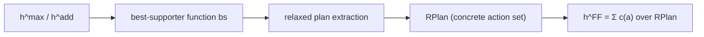

# Week 4 — Relaxation and Delete Relaxation Heuristics

> [!abstract] Orientation — read this first (~1 min)
> **The problem this week solves.** Week 3 established what a heuristic needs to
> guarantee (safe, admissible, and so on) but left open where one actually comes from.
> A planner has to accept arbitrary PDDL and produce a heuristic for it with no human in
> the loop. Week 4 supplies the general answer, relaxation, works through its simplest
> instance (goal counting) far enough to see it fail, then builds the one relaxation
> that dominates modern planning practice — the delete relaxation — all the way from a
> one-line definition to the heuristic ($h^\text{FF}$) that real systems actually run.
>
> **Core claims**
> 1. A relaxation is a triple: simplify the problem, solve (or approximate) the
>    simplified version optimally, use that cost as the heuristic — admissibility
>    follows automatically because a simpler problem never costs more to solve.
> 2. Three properties classify a relaxation — native, efficiently constructible,
>    efficiently computable — and none of the three is required for usefulness.
> 3. Goal counting (drop preconditions and deletes) is native and constructible but
>    not exactly computable: the relaxed problem is itself NP-hard once an action can
>    add more than two facts, so goal counting approximates rather than solves it, and
>    the result is an almost uninformative heuristic.
> 4. The delete relaxation drops only delete effects ("what was once true remains true
>    forever"). It is provably admissible via the state-dominance argument: relaxed
>    states can only grow, so relaxed actions can never turn a solvable task unsolvable.
> 5. $h^+$, the cost of an optimal relaxed plan, is admissible but NP-complete to
>    compute exactly — proved by a direct reduction from SAT.
> 6. $h^\text{max}$ and $h^\text{add}$ are the two classical polynomial approximations
>    of $h^+$, differing only in max versus sum over sub-goals: $h^\text{max}$ is
>    admissible but typically far too optimistic; $h^\text{add}$ is typically far more
>    informative but inadmissible, because it over-counts shared sub-plans.
> 7. The relaxed-plan heuristic $h^\text{FF}$ fixes most of $h^\text{add}$'s
>    over-counting by extracting one concrete relaxed plan (via a closed, well-founded
>    best-supporter function) and costing only the actions actually collected.
>    It remains formally inadmissible but is what real planners run.
> 8. Helpful actions — the applicable actions that also appear in the extracted relaxed
>    plan — let a search prune or bias its successor generation using the same
>    computation that already produced the heuristic value.
>
> **Prerequisites.** [[heuristic-function]], [[heuristic-properties]],
> [[planning-complexity]], [[strips]].
> **Where it sits.** Week 3 gave the theory for judging a heuristic once you have one;
> week 4 gives the general method (relaxation) and its single most important instance
> (delete relaxation) for actually producing one. Week 5 builds on $h^\text{FF}$ and
> novelty to introduce [[best-first-width-search]].
> **Sources.** 9 videos (~70 min) + 2 live-lecture decks (19 + 50 slides) ·
> **digest read time ~35 min**

---

## The Spine

### Motivation: who writes the heuristic?
`L4 slides 1–4` · [`0:00`](https://www.youtube.com/watch?v=vHi7ZZjAooU)

The starting complaint is concrete: even for a single familiar domain (Pac-Man),
designing a good heuristic by hand took real thought and time. A planner accepting
arbitrary PDDL input has no designer standing by to do that work per-problem, so the
subject's two selling points from lectures 1–2 — generality and rapid prototyping —
collapse unless a heuristic can be derived automatically from the problem description
alone. That is the job "relaxation" does. The lecture notes explicitly that a user
could still be *offered* the option of supplying an extra hand-written heuristic, but
that is out of scope here — the target is a method requiring nothing more than the PDDL
input.

---

### Relaxation, informally
`L4 slides 6–9` · [`2:24`](https://www.youtube.com/watch?v=vHi7ZZjAooU&t=144s)

The recipe, stated before any formalism: you have a problem $\mathcal{P}$ whose perfect
heuristic $h^*$ you want to estimate. You define a simpler problem $\mathcal{P}'$ whose
perfect heuristic $h'^*$ can be used to estimate $h^*$. You define a transformation $r$
simplifying instances of $\mathcal{P}$ into instances of $\mathcal{P}'$. Given
$\Pi \in \mathcal{P}$, you estimate $h^*(\Pi)$ by $h'^*(r(\Pi))$.

Two worked examples fix the pattern before it is made precise.

**Route-finding → straight-line distance.** For a road map (the classic Romania
example), the relaxation is "pretend you're a bird": every city becomes connected to
every other by a straight line, and the transformation is completing the graph and
reading off Euclidean distance. Ignore the roads; fly.

**STRIPS → goal counting.** Worked on a running example (`w04-3` "goal counting in
Australia"): a truck must visit every marked Australian city and return to Sydney.
Propositions are $at(x)$ and $v(x)$ (visited) for each city; the action
$drive(x,y)$ has precondition $\{at(x)\}$, adds $\{at(y), v(y)\}$, deletes $\{at(x)\}$.
The relaxation drops every action's preconditions *and* deletes: actions become
applicable anywhere, and only ever add facts. Hand-tracing a plan for this relaxed
problem from Sydney — `drive(Sy,Br)`, `drive(Sy,Ad)`, `drive(Ad,Pe)`, `drive(Ad,Da)` —
reaches the goal in four actions, which is exactly the number of goal facts not already
true in the initial state.

> [!mic] Not on the slides — [`4:03`](https://www.youtube.com/watch?v=74DJLrCVdd8&t=243s)
> Working the Australian example live, the lecturer deliberately makes a mistake to show
> what "no deletes" actually licenses: he applies `drive(Ad,Sy)` even though the truck
> already started at Sydney, and points out the action is "quite useless" because both
> its add effects (`at(Sy)`, `v(Sy)`) are already true — nothing changed, so it is a
> valid but pointless step. The moral: relaxed actions can be applied in any order
> without breaking anything, but some orders waste steps a *cost-minimal* relaxed plan
> would avoid. This is exactly the gap the later distinction between "any relaxed plan
> exists" and "the optimal relaxed plan" ($h^+$) turns on.

---

### Relaxation, formally
`L4 slides 11–14` · [`0:00`](https://www.youtube.com/watch?v=rHhOKImSFcg)

> [!info] Definition (Relaxation)
> Let $h^* : \mathcal{P} \mapsto \mathbb{R}_0^+ \cup \{\infty\}$ be a function. A
> *relaxation* of $h^*$ is a triple $\mathcal{R} = (\mathcal{P}', r, h'^*)$ where
> $\mathcal{P}'$ is an arbitrary set, and $r : \mathcal{P} \mapsto \mathcal{P}'$ and
> $h'^* : \mathcal{P}' \mapsto \mathbb{R}_0^+ \cup \{\infty\}$ are functions so that,
> for all $\Pi \in \mathcal{P}$, the *relaxation heuristic*
> $h^{\mathcal{R}}(\Pi) := h'^*(r(\Pi))$ satisfies $h^{\mathcal{R}}(\Pi) \le h^*(\Pi)$.
> The relaxation is:
> - **native** if $\mathcal{P}' \subseteq \mathcal{P}$ and $h'^* = h^*$ (same
>   computational method, not necessarily the same values);
> - **efficiently constructible** if a polynomial-time algorithm computes $r(\Pi)$;
> - **efficiently computable** if a polynomial-time algorithm computes $h'^*(\Pi')$.

The admissibility bound $h^{\mathcal{R}} \le h^*$ is built into the definition, not an
extra property to prove — the lecture calls this "the reminder": you simplify, you take
the simplified problem's optimum, and a simplified problem's optimum can never exceed
the original's.

The lecture is explicit that this definition is its own invention — "not to be found in
any textbook" — offered because it "nicely fits what is currently used in planning" and
"captures the basic construction... of all relaxation ideas," while conceding the
*native* clause specifically is debatable and won't be examined precisely.

Checked against the two worked examples:

| Relaxation | Native? | Efficiently constructible? | Efficiently computable? |
|---|---|---|---|
| Route-finding → straight-line ("bird") | **No** — a fully-connected straight-line graph is not itself a road network | **Yes** — complete the graph, read off distances | **Yes** — a table lookup |
| STRIPS → goal counting (drop preconditions & deletes) | **Yes** — a STRIPS task with empty preconditions/deletes is still a STRIPS task | **Yes** — literally delete two lists | **No** — see below |

The straight-line relaxation is not native because "root finding for birds" (a
fully-connected graph with Euclidean edge weights) cannot itself be constructed as an
instance of road-based route-finding — there is no map where every pair of cities is
mutually reachable by a straight road.

---

### Goal counting is not efficiently computable
`L4 slides 9, 18` · [`9:49`](https://www.youtube.com/watch?v=74DJLrCVdd8&t=589s)

The one substantive negative result of the lecture: optimal STRIPS planning restricted
to zero preconditions and empty deletes is **still NP-hard** once an action is allowed
more than two positive (add) postconditions, by reduction from **minimum set cover** —
finding the smallest subset of add-effect sets whose union covers every goal fact is
literally minimum cover. The threshold is precise and comes from a named complexity
result (Bylander) covering which restrictions of STRIPS stay polynomial: zero
preconditions and two positive postconditions is polynomial (the Australian
goal-counting example lives exactly here); three preconditions tips into NP-complete.

So the simplified problem $\mathcal{P}'$ (STRIPS with empty preconditions/deletes) is
native and cheap to *construct*, but its own optimal heuristic $h'^*$ is not cheap to
*compute*. The general recovery, stated as a template for any relaxation that fails
constructibility or computability, is one of: (a) approximate the failing piece, (b)
redesign it to be typically feasible without a formal guarantee, or (c) accept the cost
and hope for the best. Goal counting takes option (a): it approximates the relaxed
problem's true (hard) optimal cost by literally counting the number of currently-false
goal propositions, discarding every piece of information about which actions or how
many steps would actually be required.

---

### How a relaxation plugs into search
`L4 slide 20` · [`0:00`](https://www.youtube.com/watch?v=o4Mwdvrhg1k)

$\Pi_s$ denotes the planning task $\Pi = (F, A, c, I, G)$ with its initial state
replaced by search state $s$, i.e. $(F, A, c, s, G)$ — "the task of finding a plan for
search state $s$." During heuristic search, the relaxation runs once per generated
state: $h^{\mathcal{R}}(s) = h'^*(r(\Pi_s))$. Nothing else about the relaxation affects
the search — the lecture flags this explicitly as easy to misread for *native*
relaxations like dropping deletes, where it can look as though the search itself is
somehow running under relaxed dynamics. It is not: the relaxation exists purely to
produce a number.


---

### Verdict on goal counting
`L4 slides 25–26` · [`0:00`](https://www.youtube.com/watch?v=o4Mwdvrhg1k)

Goal counting is closed out as deliberately weak, on three counts stated on the
"Remarks" slide. Its range is small ($0 \ldots |G|$). Any planning task can be
re-encoded so $h(s) = 1$ for every non-goal state without changing the underlying
problem — so a small range is not just an inconvenience, it caps how much information
the heuristic can ever carry. And it ignores almost all structure: the value never
depends on which actions exist or what they cost, only on which goal facts are
currently false. The closing line points forward exactly: "we will see... how to
compute much better heuristic functions."

---

### The 8-puzzle exercise
`L4 (no formal slides — exercise videos)` · [`0:01`](https://www.youtube.com/watch?v=ny1mw8G1dTk)

Two short videos pose (without answering) the same relaxation exercise on the 8-puzzle,
whose perfect heuristic $h^*$ is defined over the actions "a tile can move from square
A to square B if A and B are adjacent, and B is blank" — two conjunctive preconditions.
The question: can dropping one, the other, or both of these preconditions be shown to
recover the Manhattan-distance heuristic or the misplaced-tiles heuristic?

> [!mic] Not on the slides — [`3:12`](https://www.youtube.com/watch?v=ny1mw8G1dTk&t=192s)
> The lecturer's tip, given rather than the answer: "there are two conditions when you
> can apply the move... if you remove one of these conditions, would you get the
> Manhattan distance heuristic?" The follow-up video on properties ([`0:00`](https://www.youtube.com/watch?v=ayrxK8xHxeY))
> notes that neither relaxation is native, because changing the move rule produces a
> puzzle that is no longer "the" 8-puzzle — there is no 8-puzzle configuration whose
> real dynamics match the relaxed one — and leaves constructibility and computability
> as further self-check questions rather than answering them.

---

### The delete relaxation: definition
`L5 slides 6–7` · [`0:00`](https://www.youtube.com/watch?v=K8caM3LNE88)

> [!info] Definition (Delete Relaxation)
> (i) For a STRIPS action $a$, $a^+$ denotes the *delete relaxed action*: $pre_{a^+} :=
> pre_a$, $add_{a^+} := add_a$, $del_{a^+} := \emptyset$.
> (ii) For a set $A$ of actions, $A^+ := \{a^+ \mid a \in A\}$; for a sequence
> $\vec{a} = \langle a_1,\dots,a_n\rangle$, $\vec{a}^+ := \langle a_1^+,\dots,a_n^+\rangle$.
> (iii) For a planning task $\Pi = (F,A,c,I,G)$, $\Pi^+ := (F,A^+,c,I,G)$ is the
> *(delete) relaxed planning task*.
>
> **Definition (Relaxed Plan).** An (optimal) relaxed plan for a state $s$ is an
> (optimal) plan for $\Pi^+_s$. A relaxed plan for $I$ is also called a relaxed plan
> for $\Pi$.

The slogan, given first via two vignettes before any formalism: "what was once true
remains true forever." Handing over money in the relaxed world leaves both parties
holding it; drinking a full pint under an action whose only effect is "drink" leaves
both a full glass *and* an empty one. The delete relaxation is one of four named
families of relaxation-based heuristics — critical path heuristics, delete relaxation,
abstractions, landmarks — and the course covers only delete relaxation, for two stated
reasons: most state-of-the-art planners are built on it, and it is (in the lecturer's
judgement) the most pedagogically simple and elegant of the four.

Worked on the Australian TSP example: a relaxed plan for the initial state applies
`drive(Sy,Br)`, `drive(Sy,Ad)`, `drive(Ad,Pe)`, `drive(Ad,Da)` — the truck never has to
"return" anywhere it has already visited, because `at(Sy)` is never deleted by
`drive(Sy,·)`.

---

### State dominance and admissibility
`L5 slides 9–10` · [`0:51`](https://www.youtube.com/watch?v=Ivmmc8G_5yo&t=51s)

> [!info] Definition (Dominance)
> Let $\Pi^+ = (F,A^+,c,I,G)$ be a STRIPS planning task and $s^+, s'^+$ states. $s'^+$
> *dominates* $s^+$ if $s'^+ \supseteq s^+$.

> [!info] Proposition (Dominance)
> If $s'^+$ dominates $s^+$: (i) if $s^+$ is a goal state, so is $s'^+$; (ii) if
> $\vec{a}^+$ is applicable in $s^+$, it is applicable in $s'^+$ too, and
> $appl(s'^+, \vec{a}^+)$ dominates $appl(s^+, \vec{a}^+)$.

*Proof sketch.* (i) is immediate from $s^+ \subseteq s'^+$. (ii) is by induction on the
length $n$ of $\vec{a}^+$: base case $n=0$ trivial; inductive step follows directly
from the induction hypothesis plus the definition of $appl$.

The connecting proposition ties ordinary and relaxed application together:
$appl(s,a^+)$ dominates both (i) $s$ and (ii) $appl(s,a)$ — trivial from the definitions
of $appl$ and $a^+$, since a relaxed action can only ever add what the ordinary version
would also have added.

> [!info] Proposition (Delete Relaxation is Admissible)
> Let $\Pi = (F,A,c,I,G)$, let $s$ be a state, and let $\vec{a}$ be a plan for $\Pi_s$.
> Then $\vec{a}^+$ is a relaxed plan for $s$.

*Proof.* By induction on the length of $\vec{a}$ that $appl(s,\vec{a}^+)$ dominates
$appl(s,\vec{a})$; base case trivial, inductive case follows from the connecting
proposition above. $\blacksquare$

The upshot, stated directly: applying a relaxed action can only make facts true and can
never render a solvable task unsolvable. So $h^+$ (defined next) is admissible almost by
construction — the optimal relaxed plan is never longer than the optimal real plan,
because any real optimal plan, stripped of its deletes, is *already* a valid (typically
shorter) relaxed plan.

> [!mic] Not on the slides — [`12:26`](https://www.youtube.com/watch?v=Ivmmc8G_5yo&t=746s)
> The lecturer states the one-directional nature of this bound plainly: "the optimal
> relaxed plan... is shorter [than] the optimal plan for the original task... the other
> direction is not true — a plan for a delete-relaxed task is not guaranteed to be a
> valid plan in the original problem." This is the exact reason $h^+$ underestimates
> rather than equals $h^*$ in general.

---

### Greedy relaxed planning
`L5 slide 11` · pseudocode block

```
Greedy Relaxed Planning for Π⁺ₛ
s⁺ := s; a⃗⁺ := ⟨⟩
while G ⊄ s⁺ do:
    if ∃a ∈ A s.t. pre_a ⊆ s⁺ and appl(s⁺, a⁺) ≠ s⁺ then
        select one such a
        s⁺ := appl(s⁺, a⁺); a⃗⁺ := a⃗⁺ ∘ ⟨a⁺⟩
    else return "Πₛ⁺ is unsolvable" endif
endwhile
return a⃗⁺
```

> [!info] Proposition
> Greedy relaxed planning is sound, complete, and terminates in time polynomial in the
> size of $\Pi$.

*Proof.* Soundness: if $\vec{a}^+$ is returned, then by construction $G \subseteq
appl(s,\vec{a}^+)$. Completeness: if "unsolvable" is returned, no relaxed plan exists
for $s^+$ at that point; since $s^+$ dominates $s$, the dominance proposition means no
relaxed plan can exist for $s$ either. Termination: every $a \in A$ can be selected at
most once, because afterwards $appl(s^+,a^+) = s^+$ (its effect is already fully
absorbed). $\blacksquare$

This gives an easy way to decide *whether* a relaxed plan exists at all, without yet
saying anything about its cost.

---

### $h^+$: the optimal delete relaxation heuristic
`L5 slides 12–17` · [`0:00`](https://www.youtube.com/watch?v=owgbsrxD_j4)

> [!info] Definition ($h^+$)
> Let $\Pi = (F,A,c,I,G)$ be a STRIPS planning task with state space
> $\Theta_\Pi = (S,A,c,T,I,G)$. The *optimal delete relaxation heuristic* $h^+$ is
> $h^+ : S \mapsto \mathbb{R}_0^+ \cup \{\infty\}$ where $h^+(s)$ is the cost of an
> optimal relaxed plan for $s$.
>
> **Corollary ($h^+$ is Admissible).** $h^+$ is admissible, and thus safe and
> goal-aware.

$h^+$'s value on two illustrative tasks: on a TSP-style task, $h^+(\mathrm{TSP})$ equals
the cost of a **minimum spanning tree** over the visited locations — the relaxed truck
never needs to backtrack, so an MST connects every required location at minimum total
edge cost. On the $n$-disk Towers of Hanoi, $h^+(\mathrm{Hanoi}) = n$, not $2^n$ —
dropping deletes means a disk placed on a peg never has to be moved off again to make
room, collapsing the exponential recursive structure of the real problem to a linear
one.

> [!info] Theorem (Optimal Relaxed Planning is Hard)
> $\mathrm{PlanOpt}^+$ — deciding, given $\Pi=(F,A,c,I,G)$ and $B \in \mathbb{R}_0^+$,
> whether a relaxed plan of cost $\le B$ exists — is **NP-complete**.

*Proof (hardness, by reduction from SAT).* For each CNF variable $v_i$, three facts
$v_i$, $notv_i$, $setv_i$; for each clause $c_j$, one fact $satc_j$. Actions
$setvtrue_i : (\emptyset, \{v_i, setv_i\}, \emptyset)$ and
$setvfalse_i : (\emptyset, \{notv_i, setv_i\}, \emptyset)$; actions
$makesatc_j : (\{v_i\}, \{satc_j\}, \emptyset)$ where $v_i$ appears positively in $c_j$,
and $(\{notv_i\}, \{satc_j\}, \emptyset)$ where $v_i$ appears negatively. Initial state
$\emptyset$, goal $\{setv_1,\dots,setv_m,satc_1,\dots,satc_n\}$, bound $B := m+n$. A
cost-$(m+n)$ relaxed plan exists exactly when every $setv_i$ (choose true/false for each
variable) and every $satc_j$ (satisfy every clause) can be achieved for the minimum
possible cost of one action per variable and one per clause — exactly a satisfying
assignment. $\blacksquare$

So $h^+$ is admissible but intractable, exactly mirroring goal counting's own failure at
efficient computability one level up — every real system therefore approximates it.

---

### $h^\text{max}$ and $h^\text{add}$
`L5 slides 22–29` · [`0:00`](https://www.youtube.com/watch?v=owgbsrxD_j4)

> [!info] Definition ($h^\text{add}$, $h^\text{max}$)
> Let $\Pi = (F,A,c,I,G)$. $h^\text{add}(s) := h^\text{add}(s,G)$ where
> $h^\text{add}(s,g)$ is the point-wise greatest function satisfying
> $$
> h^\text{add}(s,g) =
> \begin{cases}
> 0 & g \subseteq s \\
> \min_{a \in A,\ g \in add_a} c(a) + h^\text{add}(s, pre_a) & |g| = 1 \\
> \sum_{g' \in g} h^\text{add}(s, \{g'\}) & |g| > 1
> \end{cases}
> $$
> $h^\text{max}$ is the identical equation with $\max_{g' \in g}$ replacing the sum.

Both are evaluated bottom-up (a Bellman-Ford-style fixed point), starting from facts
already true in $s$ (cost 0), and both approximate $h^+$ by the same core assumption —
singleton sub-goals can be achieved *independently* — differing only in how the
sub-goal estimates combine.

> [!info] Propositions ($h^\text{max}$ Optimistic, $h^\text{add}$ Pessimistic)
> $h^\text{max} \le h^+$, and thus $h^\text{max} \le h^*$. For all $\Pi$,
> $h^\text{add} \ge h^+$; there exist $\Pi$ and $s$ with $h^\text{add}(s) > h^*(s)$.

The TSP example walked with the Bellman-Ford table shows $h^\text{add}(I) > h^+(I)$
because the shared action `drive(Sy,Ad)` gets counted three times — once for each
downstream goal that needs it. The logistics example (trucks and packages moving
between four cities A–B–C–D) makes the failure mode dramatic: if 100 packages all sit at
C and all need to reach D, $h^\text{add}$ pays for the truck's C→D trip 100 separate
times, because it sums over goals treating each as needing entirely independent work.

| | $h^\text{max}$ | $h^\text{add}$ |
|---|---|---|
| Combine rule | max over sub-goals | sum over sub-goals |
| Admissible | Yes ($\le h^+ \le h^*$) | No ($\ge h^+$; can exceed $h^*$) |
| Typical informativeness | far too optimistic in practice | much more informed, but over-counts |
| Cost to compute | polynomial (Bellman-Ford style) | polynomial (Bellman-Ford style) |

---

### Relaxed plans, best-supporter functions, and $h^\text{FF}$
`L5 slides 31–40` · [`0:00`](https://www.youtube.com/watch?v=owgbsrxD_j4)

The fix for $h^\text{add}$'s over-counting: instead of *summing* every sub-goal's cost
independently, extract one concrete plan and cost only the actions it actually
contains, so a shared action is only ever paid for once.

> [!info] Definition (Best-Supporters from $h^\text{max}$ and $h^\text{add}$)
> $bs_s^\text{max}(p) := \arg\min_{a \in A,\ p \in add_a} c(a) + h^\text{max}(s, pre_a)$;
> $bs_s^\text{add}(p) := \arg\min_{a \in A,\ p \in add_a} c(a) + h^\text{add}(s, pre_a)$ —
> each assigns fact $p$ the single cheapest action believed to achieve it.

> [!info] Definition (Best-Supporter Function, general)
> A best-supporter function for $s$ is a partial function $bs : (F \setminus s)
> \mapsto A$ with $p \in add_a$ whenever $a = bs(p)$. Its *support graph* has vertices
> $F \cup A$ and arcs $\{(p,a) \mid p \in pre_a\} \cup \{(a,p) \mid a = bs(p)\}$. $bs$
> is *closed* if defined for every $p \in (F \setminus s)$ with a path to a goal in the
> support graph, and *well-founded* if that support graph is acyclic.

```
Relaxed Plan Extraction for state s and best-supporter function bs
Open := G \ s; Closed := ∅; RPlan := ∅
while Open ≠ ∅ do:
    select g ∈ Open
    Open := Open \ {g}; Closed := Closed ∪ {g}
    RPlan := RPlan ∪ {bs(g)}; Open := Open ∪ (pre_{bs(g)} \ (s ∪ Closed))
endwhile
return RPlan
```

Fast — number of iterations bounded by $|F|$, each near-constant. Correctness needs
$bs$ closed and well-founded: without closedness there is nothing to select for some
open fact; without well-foundedness, backward chaining can cycle without ever
resolving down to $s$.

> [!info] Proposition
> Let $\Pi = (F,A,c,I,G)$ with $c(a) > 0$ for all $a$, and $s$ a state with
> $h^+(s) < \infty$. Then both $bs_s^\text{max}$ and $bs_s^\text{add}$ are closed,
> well-founded supporter functions for $s$.

*Proof sketch.* $h^+(s) < \infty \implies h^\text{max}(s) < \infty$, so $bs_s^\text{max}$
is closed. If $a = bs_s^\text{max}(p)$, then $a$ is the action yielding
$0 < h^\text{max}(s,\{p\}) < \infty$; since $c(a) > 0$, $h^\text{max}(s,pre_a) <
h^\text{max}(s,\{p\})$, so for every $q \in pre_a$, $h^\text{max}(s,\{q\}) <
h^\text{max}(s,\{p\})$. Transitively, a support-graph path from fact $r$ to fact $t$
forces $h^\text{max}(s,\{r\}) < h^\text{max}(s,\{t\})$ — so no cycle can exist. Similarly
for $bs_s^\text{add}$. $\blacksquare$

> [!example] Worked example — logistics support graphs
> One truck route A–B–C–D, initial state $t(A)$, goal $t(D)$. A *well-founded*
> best-supporter function chains cleanly: $bs(t(B)) = dr(A,B)$, $bs(t(C)) = dr(B,C)$,
> $bs(t(D)) = dr(C,D)$ — backward chaining walks straight from $t(D)$ down to $t(A) \in
> s$. A *not well-founded* one — $bs(t(B)) = dr(C,B)$, $bs(t(C)) = dr(B,C)$,
> $bs(t(D)) = dr(C,D)$ — creates a two-cycle between $t(B)$ and $t(C)$ (each is
> supported by an action whose precondition is the other), and backward chaining from
> $t(D)$ never reaches $t(A)$.

> [!info] Proposition (Extraction Correctness)
> Let $bs$ be a closed, well-founded best-supporter function for $s$. The action set
> $RPlan$ returned by extraction can be sequenced into a relaxed plan $\vec{a}^+$ for
> $s$.

*Proof.* Order $a$ before $a'$ whenever the support graph has a path from $a$ to $a'$;
since the graph is acyclic, such a sequencing $\vec{a} = \langle a_1,\dots,a_n\rangle$
exists. Every $p \in pre_{a_1}$ is in $s$ — otherwise $RPlan$ would contain $bs(p)$,
necessarily ordered before $a_1$. Every $p \in pre_{a_2}$ is in $s \cup add_{a_1}$, by
the same argument. Iterating shows $\vec{a}^+$ is a relaxed plan for $s$. $\blacksquare$

> [!info] Definition (Relaxed Plan Heuristic)
> $h^\text{FF}(s)$ returns $\infty$ if no relaxed plan exists, and otherwise
> $\sum_{a \in RPlan} c(a)$ for $RPlan$ returned by extraction on a closed, well-founded
> best-supporter function for $s$.

> [!info] Proposition ($h^\text{FF}$ Pessimistic, Agrees with $h^+$ on $\infty$)
> For all $\Pi$, $h^\text{FF} \ge h^+$; for all states, $h^+(s) = \infty$ iff
> $h^\text{FF}(s) = \infty$. There exist $\Pi, s$ with $h^\text{FF}(s) > h^*(s)$.

So $h^\text{FF}$ has exactly the same *formal* status as $h^\text{add}$ — pessimistic,
generally inadmissible — but because relaxed plan extraction only ever collects a given
supporting action once no matter how many facts it supports, $h^\text{FF}$ in practice
avoids the dramatic over-counting the logistics example showed for $h^\text{add}$.



---

### Helpful actions
`L5 slide 41` · [`0:00`](https://www.youtube.com/watch?v=owgbsrxD_j4)

> [!info] Definition (Helpful Actions)
> Let $h^\text{FF}$ be a relaxed plan heuristic, $s$ a state, $RPlan$ the action set
> underlying $h^\text{FF}(s)$. An action $a$ applicable in $s$ is *helpful* if it is
> contained in $RPlan$.

Introduced in FF (Hoffmann & Nebel), restricting [[enforced-hill-climbing]] to expand
**only** helpful actions — a deliberate completeness sacrifice traded for speed. Other
planners use helpful actions as *preferred operators* instead: nodes reached via a
helpful action are expanded first, but the full action set remains available, so
completeness survives.

---

### What ignoring deletes actually simplifies, per domain
`L5 slide 43` · [`0:00`](https://www.youtube.com/watch?v=owgbsrxD_j4)

Two closing quiz examples ground the abstraction in concrete domain intuition. In
FreeCell, dropping deletes means a card can move directly to its goal pile immediately,
regardless of what currently sits above it in a column or in a free cell — the "in the
way" facts are never actually removed to require clearing. In Sokoban, it means nothing
ever becomes blocked: a pushed stone can never get stuck against a wall or another
stone, because "blocked" is entirely encoded as a deleted "empty cell" fact, and deletes
are gone.

---

### Real systems built on this chain
`L5 slide 45` · [`0:00`](https://www.youtube.com/watch?v=owgbsrxD_j4)

| System | Search algorithm | Search control |
|---|---|---|
| HSP [Bonet & Geffner, AI-01] | Greedy best-first search | $h^\text{add}$ |
| FF [Hoffmann & Nebel, JAIR-01] | Enforced hill-climbing | $h^\text{FF}$ from $h^\text{max}$ supporters; helpful-actions pruning |
| LAMA [Richter & Westphal, JAIR-10] | Multi-queue greedy best-first search | $h^\text{FF}$ + a landmarks heuristic; one queue all actions, one queue helpful-only |
| BFWS [Lipovetzky & Geffner, AAAI-17] | Best-first width search (next lecture) | novelty + a variant of $h^\text{FF}$ + goal counting |

> [!mic] Not on the slides — footnote text, [`slide 49`](https://www.youtube.com/watch?v=owgbsrxD_j4)
> The lecturer flags a subtlety in how FF's paper is normally cited versus how this
> course presents it: FF's original presentation used relaxed *planning graphs* under
> uniform action cost, not $h^\text{max}$ directly, and did not name the general notion
> of a well-founded best-supporter function — that generalisation to non-uniform action
> costs is credited to Keyder and Geffner (ECAI-08). The digest above follows the
> course's simpler, generalised presentation rather than FF's original one.

---

## Recall Layer

> [!question]- What three properties classify a relaxation, and is any one of them required for the relaxation to be useful?
> Native ($\mathcal{P}' \subseteq \mathcal{P}$, same computational method as $h^*$),
> efficiently constructible (polynomial $r$), efficiently computable (polynomial
> $h'^*$). None is required — plenty of useful relaxations lack one or more. (L4 slide
> 12)

> [!question]- Why is goal counting native but not efficiently computable?
> It's native because a STRIPS task with empty preconditions and deletes is still a
> STRIPS task. It's not efficiently computable because computing that simplified
> problem's own optimal plan cost is NP-hard once an action can add more than two
> facts (reduction from minimum set cover) — so goal counting approximates rather than
> exactly solves it. (L4 slides 9, 18)

> [!question]- State the delete-relaxed action $a^+$ formally.
> $pre_{a^+} := pre_a$, $add_{a^+} := add_a$, $del_{a^+} := \emptyset$ — same
> preconditions and adds, empty deletes. (L5 slide 7)

> [!question]- What does state dominance mean, and what does it prove about the delete relaxation?
> $s'$ dominates $s$ if $s \subseteq s'$. Because relaxed action application only ever
> grows the state (never deletes), applying it can never turn a goal state into a
> non-goal state, nor make a previously-applicable action sequence inapplicable — so
> the relaxation of any real plan is a valid relaxed plan, giving $h^+ \le h^*$. (L5
> slides 9–10)

> [!question]- Why is greedy relaxed planning sound, complete, and polynomial, but not useful for computing $h^+$ directly?
> It only decides *whether* a relaxed plan exists (any relaxed plan, arbitrary length),
> not the *cheapest* one — computing the optimal relaxed plan cost is the separate,
> NP-complete problem $\mathrm{PlanOpt}^+$. (L5 slides 11, 17)

> [!question]- Sketch why $\mathrm{PlanOpt}^+$ is NP-complete.
> Reduction from SAT: three facts per variable ($v_i$, $notv_i$, $setv_i$), one fact
> per clause ($satc_j$); actions to set each variable true/false, and actions that mark
> a clause satisfied once a variable with the right polarity is set. A cost-$(m+n)$
> relaxed plan exists iff the CNF formula is satisfiable. (L5 slide 17)

> [!question]- $h^\text{max}$ and $h^\text{add}$ share the same recursive definition except for one case. Which, and what's the practical trade-off?
> The $|g| > 1$ case: $h^\text{max}$ takes the max over sub-goal costs (admissible but
> typically far too optimistic); $h^\text{add}$ takes the sum (typically much more
> informative but inadmissible, since it over-counts work shared between sub-goals).
> (L5 slides 22–23, 29)

> [!question]- What must a best-supporter function satisfy for relaxed plan extraction to actually produce a valid plan?
> It must be *closed* (defined for every fact with a path to a goal in the support
> graph) and *well-founded* (that support graph acyclic) — both hold automatically for
> $bs^\text{max}_s$ and $bs^\text{add}_s$ whenever every action cost is strictly
> positive. (L5 slides 35, 37)

> [!question]- Why does $h^\text{FF}$ typically avoid $h^\text{add}$'s over-counting, given both are formally inadmissible?
> Extraction collects each supporting action into $RPlan$ at most once, however many
> facts it happens to support — so a shared sub-plan is only ever paid for once in the
> sum, unlike $h^\text{add}$'s independent per-sub-goal summation. (L5 slides 29, 39–40)

> [!question]- What is a helpful action, and how do FF and other planners use the concept differently?
> An action applicable in the current state that also appears in the extracted relaxed
> plan underlying $h^\text{FF}$. FF restricts enforced hill-climbing to expand *only*
> helpful actions (loses completeness); other planners use them as preferred
> operators, expanding those nodes first while keeping the full action set available
> (keeps completeness). (L5 slide 41)

> [!failure] Common failure modes
> - Treating "efficiently constructible/computable" as requirements for a relaxation to
>   count — they are classifications, not gates.
> - Confusing "a relaxed plan exists" (decided cheaply by greedy relaxed planning) with
>   "the *optimal* relaxed plan cost is cheap to compute" ($h^+$, NP-complete).
> - Assuming $h^\text{FF} \ge h^+$ means it always over-estimates by a lot in practice —
>   the whole point of extraction is that it usually doesn't, unlike $h^\text{add}$.
> - Forgetting the relaxation only ever produces a number fed into search; conflating
>   the relaxed dynamics with the real search dynamics, especially for native
>   relaxations like dropping deletes.

> [!exam] Exam surface
> - Formal definitions: relaxation triple, native/constructible/computable, $a^+$,
>   state dominance, $h^+$, $h^\text{max}$/$h^\text{add}$ recursive equations,
>   best-supporter function (closed, well-founded), $h^\text{FF}$, helpful actions.
> - Proof sketches: delete relaxation admissibility (via dominance), NP-completeness of
>   $\mathrm{PlanOpt}^+$ (SAT reduction — know the encoding), why $bs^\text{max}/bs^\text{add}$
>   are well-founded under positive costs.
> - Classify a given relaxation on the three properties, as done for route-finding and
>   goal counting.
> - Compute $h^\text{max}(s)$ and $h^\text{add}(s)$ by hand on a small worked task
>   (Bellman-Ford style table), and extract a relaxed plan / $h^\text{FF}(s)$ from a
>   given best-supporter function.
> - Explain, per domain (FreeCell, Sokoban, 8-puzzle), what ignoring deletes actually
>   removes.

> [!todo] Open threads
> - The two 8-puzzle relaxation exercises (Manhattan distance, misplaced tiles) are
>   left unanswered in the source videos — worth working through by hand before the
>   live tutorial.
> - Landmarks and abstractions, the other two named relaxation families, are
>   explicitly out of scope for this course.
> - $h^\text{max}$/$h^\text{add}$-derived best-supporter functions are proved closed
>   and well-founded only under strictly positive action costs; the zero-cost case is
>   not discussed.
> - LM-cut and admissible landmark heuristics (named as "very important for optimal
>   planning" alternatives to $h^\text{max}$) are cited but not covered.

## Topics covered

- [ ] `L4 slides 1–4` — motivation for automatic heuristic derivation → [[#Motivation: who writes the heuristic?]]
- [ ] `L4 slides 6–9` — informal relaxation (route-finding, goal counting) → [[#Relaxation, informally]]
- [ ] `L4 slides 11–14` — formal relaxation triple and its three properties → [[#Relaxation, formally]]
- [ ] `L4 slides 9, 18` — NP-hardness of relaxed goal counting → [[#Goal counting is not efficiently computable]]
- [ ] `L4 slide 20` — $\Pi_s$ notation and relaxation-during-search → [[#How a relaxation plugs into search]]
- [ ] `L4 slides 25–26` — critique of goal counting's weak informativeness → [[#Verdict on goal counting]]
- [ ] pre-lecture "Question4" videos — 8-puzzle relaxation exercise → [[#The 8-puzzle exercise]]
- [ ] `L5 slides 6–8` — delete relaxation definition and TSP worked example → [[#The delete relaxation: definition]]
- [ ] `L5 slides 9–10` — state dominance, admissibility proof → [[#State dominance and admissibility]]
- [ ] `L5 slide 11` — greedy relaxed planning algorithm → [[#Greedy relaxed planning]]
- [ ] `L5 slides 12–17` — $h^+$, minimum spanning tree/Hanoi examples, NP-completeness proof → [[#$h^+$: the optimal delete relaxation heuristic]]
- [ ] `L5 slides 22–29` — $h^\text{max}$, $h^\text{add}$, worked Bellman-Ford examples → [[#$h^\text{max}$ and $h^\text{add}$]]
- [ ] `L5 slides 31–40` — best-supporter functions, extraction, $h^\text{FF}$ → [[#Relaxed plans, best-supporter functions, and $h^\text{FF}$]]
- [ ] `L5 slide 41` — helpful actions → [[#Helpful actions]]
- [ ] `L5 slide 43` — FreeCell/Sokoban quiz → [[#What ignoring deletes actually simplifies, per domain]]
- [ ] `L5 slide 45` — example systems (HSP, FF, LAMA, BFWS) → [[#Real systems built on this chain]]

## Connections

`See also:` [[relaxation]], [[goal-counting-heuristic]], [[delete-relaxation]],
[[max-heuristic]], [[additive-heuristic]], [[relaxed-plan-heuristic]],
[[helpful-actions]], [[heuristic-function]], [[heuristic-properties]],
[[enforced-hill-climbing]], [[best-first-width-search]],
[[sources/w04-prerecorded-relaxation-heuristics]],
[[sources/w04a-generating-heuristic-functions]],
[[sources/w04b-delete-relaxation-heuristics]]
